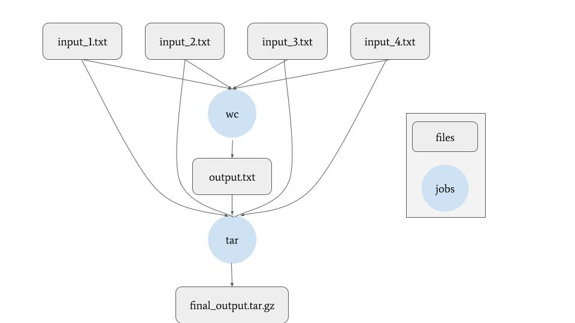

This test workflow is structured as follows:



Prior to submitting this workflow, you will need to specify
the following in `submit.sh` (lines 16-20):

```
# SET THESE VARIABLES
SSH_PRIVATE_KEY_PATH="1"
ORIGIN_SHARED_SCRATCH_PATH="2"
ORIGIN_FILE_SERVER_GET_URL="3"
ORIGIN_FILE_SERVER_PUT_URL="4"
HTTP_PROXY_URL="5"
```
